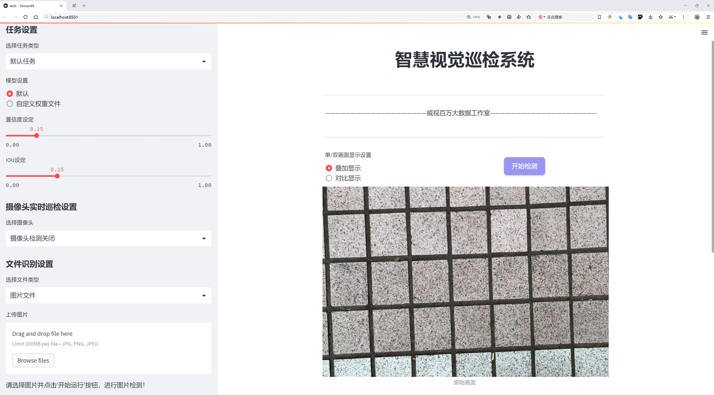
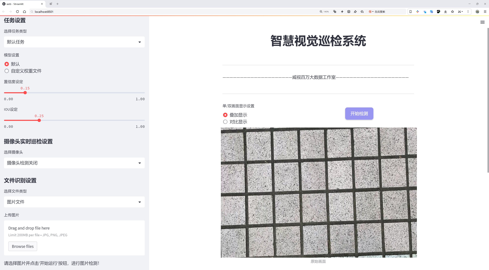
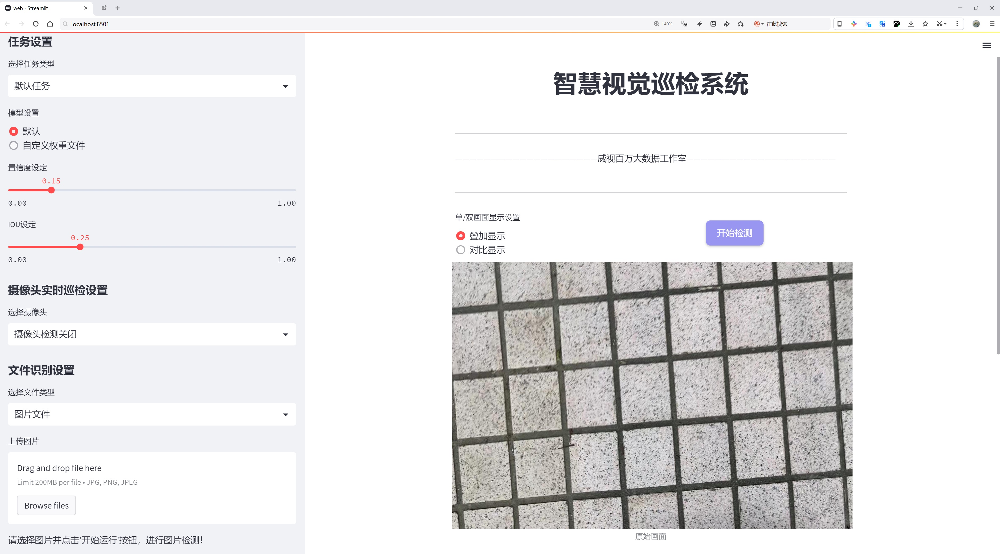
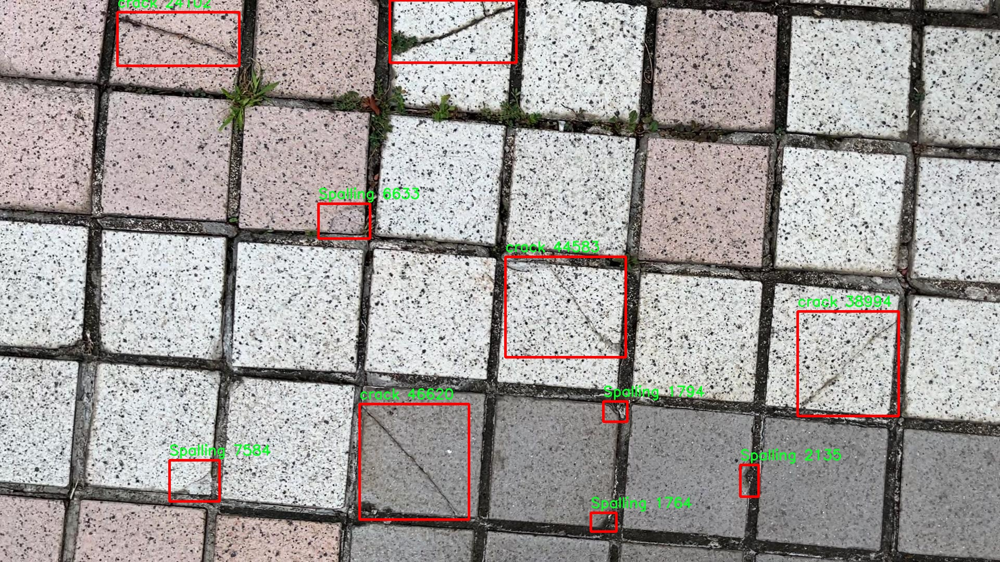
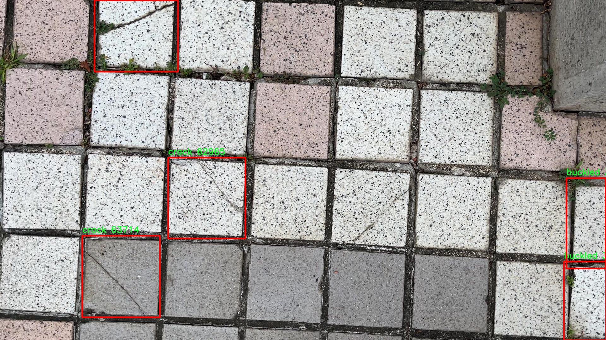
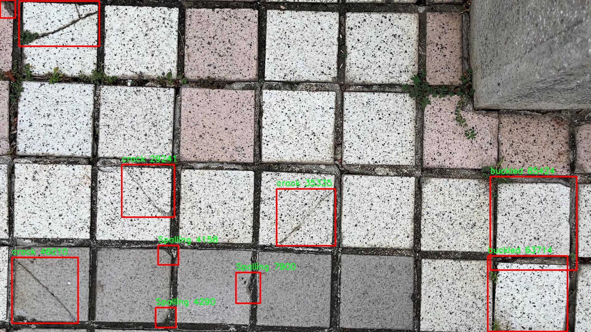
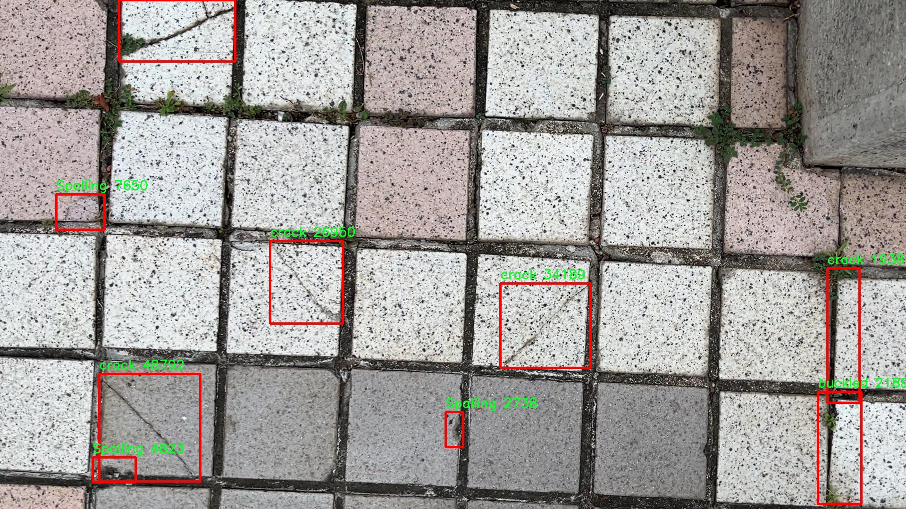
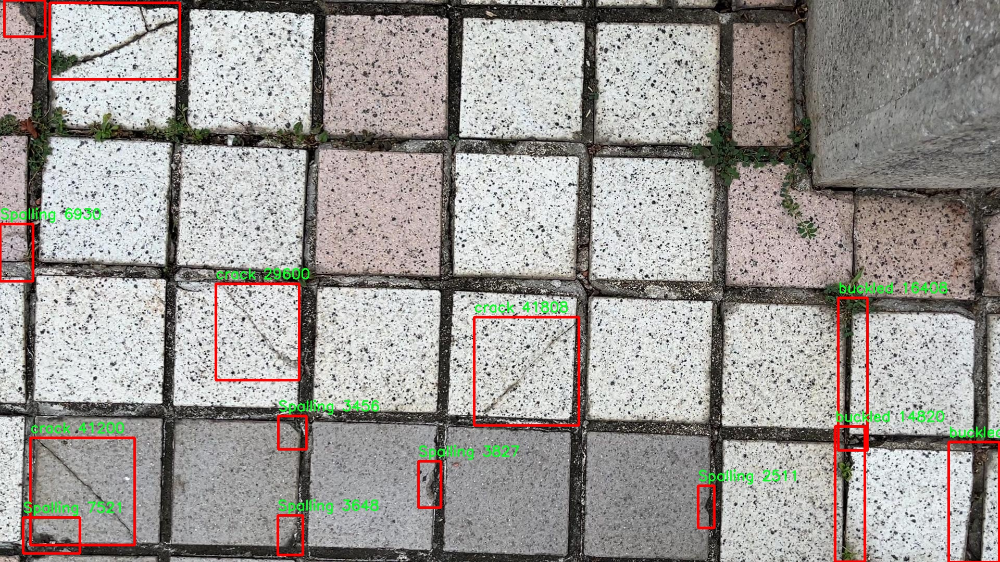

# 瓷砖缺陷检测检测系统源码分享
 # [一条龙教学YOLOV8标注好的数据集一键训练_70+全套改进创新点发刊_Web前端展示]

### 1.研究背景与意义

项目参考[AAAI Association for the Advancement of Artificial Intelligence](https://gitee.com/qunmasj/projects)

项目来源[AACV Association for the Advancement of Computer Vision](https://kdocs.cn/l/cszuIiCKVNis)

研究背景与意义

随着建筑行业的快速发展，瓷砖作为一种重要的建筑材料，其质量直接影响到建筑物的美观性和耐用性。瓷砖在生产和运输过程中，可能会出现各种缺陷，如剥落、翘曲、裂纹和脱层等。这些缺陷不仅降低了瓷砖的使用价值，还可能对整体建筑的安全性和稳定性造成威胁。因此，及时、准确地检测瓷砖缺陷显得尤为重要。传统的人工检测方法不仅效率低下，而且容易受到人为因素的影响，导致漏检和误检的情况频繁发生。因此，开发一种高效、准确的瓷砖缺陷检测系统，成为了行业亟待解决的问题。

近年来，深度学习技术的迅猛发展为图像处理领域带来了新的机遇，尤其是在目标检测方面。YOLO（You Only Look Once）系列模型因其高效的实时检测能力而广泛应用于各种物体检测任务中。YOLOv8作为该系列的最新版本，进一步提升了检测精度和速度，适合用于复杂场景下的物体识别。通过对YOLOv8模型的改进，结合瓷砖缺陷检测的实际需求，可以有效提高检测系统的性能，使其在实际应用中更具可行性。

本研究旨在基于改进的YOLOv8模型，构建一个高效的瓷砖缺陷检测系统。为此，我们使用了一个包含1700张瓷砖图像的数据集，该数据集涵盖了四种主要缺陷类别：剥落、翘曲、裂纹和脱层。这些缺陷类别的选择不仅反映了瓷砖在实际应用中常见的问题，也为模型的训练提供了丰富的样本数据。通过对这些图像进行标注和分类，我们可以为模型的训练提供坚实的基础，确保其在实际应用中的准确性和可靠性。

在研究过程中，我们将重点关注模型的改进策略，包括数据增强、特征提取和模型结构优化等。通过这些改进，我们期望提高模型对瓷砖缺陷的识别能力，降低误检率和漏检率，从而实现更高的检测精度。此外，我们还将探讨如何将该检测系统与实际生产流程相结合，形成一个完整的质量控制体系，以提升瓷砖生产的整体效率和产品质量。

综上所述，基于改进YOLOv8的瓷砖缺陷检测系统的研究，不仅具有重要的理论意义，也具备广泛的实际应用价值。通过该系统的开发与应用，可以有效提升瓷砖生产过程中的质量控制水平，降低生产成本，促进建筑行业的可持续发展。同时，该研究也为深度学习在工业检测领域的应用提供了新的思路和方法，具有较高的学术价值和应用前景。

### 2.图片演示







##### 注意：由于此博客编辑较早，上面“2.图片演示”和“3.视频演示”展示的系统图片或者视频可能为老版本，新版本在老版本的基础上升级如下：（实际效果以升级的新版本为准）

  （1）适配了YOLOV8的“目标检测”模型和“实例分割”模型，通过加载相应的权重（.pt）文件即可自适应加载模型。

  （2）支持“图片识别”、“视频识别”、“摄像头实时识别”三种识别模式。

  （3）支持“图片识别”、“视频识别”、“摄像头实时识别”三种识别结果保存导出，解决手动导出（容易卡顿出现爆内存）存在的问题，识别完自动保存结果并导出到tempDir中。

  （4）支持Web前端系统中的标题、背景图等自定义修改，后面提供修改教程。

  另外本项目提供训练的数据集和训练教程,暂不提供权重文件（best.pt）,需要您按照教程进行训练后实现图片演示和Web前端界面演示的效果。

### 3.视频演示

[3.1 视频演示](https://www.bilibili.com/video/BV1uaxuePEJ7/)

### 4.数据集信息展示

##### 4.1 本项目数据集详细数据（类别数＆类别名）

nc: 3
names: ['Spalling', 'buckled', 'crack']


##### 4.2 本项目数据集信息介绍

数据集信息展示

在本研究中，我们使用的“Tile image”数据集专门用于训练和改进YOLOv8模型，以实现高效的瓷砖缺陷检测系统。该数据集包含了多种瓷砖缺陷的图像，旨在帮助机器学习模型准确识别和分类不同类型的瓷砖损坏情况。数据集的类别数量为三，具体包括“Spalling”（剥落）、“buckled”（翘曲）和“crack”（裂缝）。这三种缺陷类型是瓷砖在使用过程中最常见的损坏形式，对瓷砖的美观性和结构完整性均有显著影响，因此在实际应用中具有重要的检测价值。

“Tile image”数据集的构建过程注重了图像的多样性和代表性，以确保模型能够在各种实际场景中有效运行。数据集中包含的图像来自不同类型的瓷砖，涵盖了多种颜色、纹理和尺寸，这为模型的训练提供了丰富的样本。每一类缺陷的图像均经过精心挑选，确保其能够清晰地展示缺陷特征，从而提高模型的学习效果和泛化能力。

在数据集的标注过程中，采用了专业的标注工具，对每张图像中的缺陷进行精准的框选和分类。这一过程不仅提高了数据的准确性，也为后续的模型训练奠定了坚实的基础。通过对“Spalling”、“buckled”和“crack”三类缺陷的详细标注，研究团队能够确保YOLOv8模型在训练时获得高质量的输入数据，从而提升其在实际应用中的检测精度。

此外，数据集的规模也是影响模型性能的重要因素之一。为了增强模型的鲁棒性，数据集中包含了大量的图像样本，确保每一类缺陷都有足够的训练数据。这种丰富的数据量不仅能够帮助模型更好地学习每种缺陷的特征，还能有效降低过拟合的风险，从而提升模型在未见数据上的表现。

在训练过程中，我们还采用了数据增强技术，以进一步扩展数据集的多样性。通过对原始图像进行旋转、缩放、翻转和颜色调整等操作，生成了更多的训练样本。这一策略不仅增加了模型的训练数据量，还提高了模型对不同环境和条件下瓷砖缺陷的适应能力，使其在实际应用中能够更好地应对各种复杂情况。

总之，“Tile image”数据集为改进YOLOv8的瓷砖缺陷检测系统提供了坚实的基础。通过对数据集的精心设计和构建，我们期望能够训练出一个高效、准确的检测模型，为瓷砖行业的质量控制和维护提供强有力的技术支持。随着模型的不断优化和改进，我们相信其在实际应用中的表现将更加出色，为用户带来更高的价值。











### 5.全套项目环境部署视频教程（零基础手把手教学）

[5.1 环境部署教程链接（零基础手把手教学）](https://www.ixigua.com/7404473917358506534?logTag=c807d0cbc21c0ef59de5)


[5.2 安装Python虚拟环境创建和依赖库安装视频教程链接（零基础手把手教学）](https://www.ixigua.com/7404474678003106304?logTag=1f1041108cd1f708b01a)

### 6.手把手YOLOV8训练视频教程（零基础小白有手就能学会）

[6.1 手把手YOLOV8训练视频教程（零基础小白有手就能学会）](https://www.ixigua.com/7404477157818401292?logTag=d31a2dfd1983c9668658)

### 7.70+种全套YOLOV8创新点代码加载调参视频教程（一键加载写好的改进模型的配置文件）

[7.1 70+种全套YOLOV8创新点代码加载调参视频教程（一键加载写好的改进模型的配置文件）](https://www.ixigua.com/7404478314661806627?logTag=29066f8288e3f4eea3a4)

### 8.70+种全套YOLOV8创新点原理讲解（非科班也可以轻松写刊发刊，V10版本正在科研待更新）

由于篇幅限制，每个创新点的具体原理讲解就不一一展开，具体见下列网址中的创新点对应子项目的技术原理博客网址【Blog】：


[8.1 70+种全套YOLOV8创新点原理讲解链接](https://gitee.com/qunmasj/good)

### 9.系统功能展示（检测对象为举例，实际内容以本项目数据集为准）

图9.1.系统支持检测结果表格显示

  图9.2.系统支持置信度和IOU阈值手动调节

  图9.3.系统支持自定义加载权重文件best.pt(需要你通过步骤5中训练获得)

  图9.4.系统支持摄像头实时识别

  图9.5.系统支持图片识别

  图9.6.系统支持视频识别

  图9.7.系统支持识别结果文件自动保存

  图9.8.系统支持Excel导出检测结果数据


### 10.原始YOLOV8算法原理

原始YOLOv8算法原理

YOLOv8算法作为目标检测领域的最新进展，延续了YOLO系列算法的优良传统，同时在多个方面进行了显著的改进与创新。其核心思想是将目标检测任务转化为一个回归问题，通过一个统一的神经网络模型，实时预测目标的位置和类别。这种方法的最大优势在于其高效性和准确性，使得YOLOv8在实际应用中能够快速响应并准确识别多种目标。

在YOLOv8的网络结构中，主要由四个部分组成：输入模块、主干网络（Backbone）、特征增强网络（Neck）和检测头（Head）。输入模块负责对图像进行预处理，包括调整图像比例、进行Mosaic增强等操作，以便为后续的特征提取提供更为丰富的信息。YOLOv8的主干网络延续了CSP（Cross Stage Partial）结构的设计理念，旨在通过跨级连接提升特征的流动性和表达能力。在此基础上，YOLOv8对C3模块进行了优化，采用了更轻量的C2f模块，旨在在保持高效性的同时，提升特征提取的能力。通过这种改进，YOLOv8能够更好地捕捉到不同尺度的目标特征，进而提高检测精度。

特征增强网络是YOLOv8的另一个重要组成部分，它结合了特征金字塔网络（FPN）和路径聚合网络（PAN）的思想，形成了一个双塔结构。这种结构不仅促进了语义特征与定位特征之间的有效转移，还增强了网络对不同尺度目标的检测能力。通过多层次的特征融合，YOLOv8能够在不同的特征层次上提取到丰富的信息，从而在复杂场景中更准确地定位和识别目标。

在检测头部分，YOLOv8采用了解耦头的设计，将分类和回归任务分为两个独立的分支。这一创新使得每个分支能够更专注于自身的任务，从而有效解决了复杂场景下的定位不准和分类错误的问题。此外，YOLOv8引入了Anchor-free目标检测方法，避免了传统方法中锚点框选择和调整的繁琐过程。通过直接预测目标的位置和大小，YOLOv8能够更快地聚焦于目标的邻近区域，使得预测框更接近实际的边界框。这种方法不仅提高了检测速度，还提升了检测精度，尤其是在处理不同尺度和形状的目标时，表现得尤为出色。

YOLOv8还在损失函数的设计上进行了创新，采用了变焦损失（Focal Loss）来计算分类损失，并引入了数据平均保真度损失和完美交并比损失来计算边界框损失。这种新的损失策略使得YOLOv8在训练过程中能够更好地平衡正负样本的影响，从而提高了模型的鲁棒性和准确性。这一策略的实施，使得YOLOv8在面对复杂背景和多目标场景时，依然能够保持高效的检测性能。

总的来说，YOLOv8算法通过对网络结构的优化、特征提取能力的增强以及损失函数的创新，达到了在检测精度和速度上的双重提升。其轻量化的设计使得模型能够在各种嵌入式设备上进行部署，满足实时检测的需求。随着YOLOv8的不断发展和应用，其在目标检测领域的潜力和价值将愈加显著，为各类智能应用提供强有力的支持。

在实际应用中，YOLOv8的优势不仅体现在其高效的检测能力上，还包括其在处理多种复杂场景时的灵活性和适应性。无论是在交通监控、安防监测，还是在无人驾驶、智能家居等领域，YOLOv8都能够提供快速、准确的目标检测解决方案。这种广泛的适用性使得YOLOv8成为了目标检测领域的重要工具，为研究人员和工程师们提供了更多的可能性。

综上所述，YOLOv8算法通过其创新的设计理念和高效的实现方式，成功地在目标检测领域树立了新的标杆。随着技术的不断进步和应用场景的日益丰富，YOLOv8必将在未来的研究和实践中发挥更大的作用，推动目标检测技术的进一步发展。


### 11.项目核心源码讲解（再也不用担心看不懂代码逻辑）

#### 11.1 ui.py

以下是经过简化和注释的核心代码部分：

```python
import sys
import subprocess
from QtFusion.path import abs_path

def run_script(script_path):
    """
    使用当前 Python 环境运行指定的脚本。

    Args:
        script_path (str): 要运行的脚本路径
    """
    # 获取当前 Python 解释器的路径
    python_path = sys.executable

    # 构建运行命令，使用 streamlit 运行指定的脚本
    command = f'"{python_path}" -m streamlit run "{script_path}"'

    # 执行命令并等待其完成
    result = subprocess.run(command, shell=True)
    
    # 检查命令执行结果，如果返回码不为0，则表示出错
    if result.returncode != 0:
        print("脚本运行出错。")

# 主程序入口
if __name__ == "__main__":
    # 获取脚本的绝对路径
    script_path = abs_path("web.py")

    # 运行指定的脚本
    run_script(script_path)
```

### 代码注释说明：

1. **导入模块**：
   - `sys`：用于访问与 Python 解释器紧密相关的变量和函数。
   - `subprocess`：用于执行外部命令和程序。
   - `abs_path`：从 `QtFusion.path` 导入的函数，用于获取文件的绝对路径。

2. **`run_script` 函数**：
   - 接受一个参数 `script_path`，表示要运行的 Python 脚本的路径。
   - 使用 `sys.executable` 获取当前 Python 解释器的路径。
   - 构建一个命令字符串，使用 `streamlit` 模块运行指定的脚本。
   - 使用 `subprocess.run` 执行命令，并等待其完成。
   - 检查命令的返回码，如果不为0，打印错误信息。

3. **主程序入口**：
   - 在 `if __name__ == "__main__":` 块中，确保只有在直接运行该脚本时才会执行以下代码。
   - 使用 `abs_path` 获取 `web.py` 的绝对路径。
   - 调用 `run_script` 函数来运行该脚本。

这个程序文件名为 `ui.py`，其主要功能是通过当前的 Python 环境来运行一个指定的脚本。文件中首先导入了必要的模块，包括 `sys`、`os` 和 `subprocess`，这些模块提供了与系统交互和执行外部命令的功能。此外，还导入了 `QtFusion.path` 模块中的 `abs_path` 函数，用于获取文件的绝对路径。

在 `run_script` 函数中，程序接受一个参数 `script_path`，这个参数是要运行的脚本的路径。函数首先获取当前 Python 解释器的路径，使用 `sys.executable` 来实现。接着，构建一个命令字符串，该命令使用 `streamlit` 来运行指定的脚本。具体的命令格式是 `"{python_path}" -m streamlit run "{script_path}"`，其中 `python_path` 是当前 Python 解释器的路径，`script_path` 是要运行的脚本路径。

随后，程序使用 `subprocess.run` 方法来执行构建好的命令。这个方法会在一个新的进程中运行命令，并等待其完成。如果命令执行后返回的状态码不为 0，表示脚本运行出错，程序会打印出相应的错误信息。

在文件的最后部分，使用 `if __name__ == "__main__":` 语句来确保只有在直接运行该文件时才会执行后面的代码。这里指定了要运行的脚本路径为 `web.py`，并调用 `run_script` 函数来执行这个脚本。

总体来说，这个程序的主要目的是为用户提供一个简单的接口，通过它可以方便地运行一个 Streamlit 应用脚本，并在出现错误时给予反馈。

#### 11.2 70+种YOLOv8算法改进源码大全和调试加载训练教程（非必要）\ultralytics\models\sam\amg.py

以下是经过简化和注释的核心代码部分：

```python
import torch
import numpy as np
from itertools import product

def is_box_near_crop_edge(boxes: torch.Tensor,
                          crop_box: List[int],
                          orig_box: List[int],
                          atol: float = 20.0) -> torch.Tensor:
    """
    判断给定的边界框是否接近裁剪边缘。

    参数:
    - boxes: 需要检查的边界框，格式为 (x_min, y_min, x_max, y_max)
    - crop_box: 当前裁剪框的边界，格式为 [x_min, y_min, x_max, y_max]
    - orig_box: 原始图像的边界框，格式为 [x_min, y_min, x_max, y_max]
    - atol: 允许的绝对误差，默认为20.0

    返回:
    - 一个布尔张量，指示每个边界框是否接近裁剪边缘。
    """
    crop_box_torch = torch.as_tensor(crop_box, dtype=torch.float, device=boxes.device)
    orig_box_torch = torch.as_tensor(orig_box, dtype=torch.float, device=boxes.device)
    
    # 将边界框转换为未裁剪的坐标
    boxes = uncrop_boxes_xyxy(boxes, crop_box).float()
    
    # 检查边界框是否接近裁剪框和原始图像边缘
    near_crop_edge = torch.isclose(boxes, crop_box_torch[None, :], atol=atol, rtol=0)
    near_image_edge = torch.isclose(boxes, orig_box_torch[None, :], atol=atol, rtol=0)
    
    # 仅保留接近裁剪边缘但不接近原始图像边缘的框
    near_crop_edge = torch.logical_and(near_crop_edge, ~near_image_edge)
    
    return torch.any(near_crop_edge, dim=1)

def uncrop_boxes_xyxy(boxes: torch.Tensor, crop_box: List[int]) -> torch.Tensor:
    """
    将裁剪的边界框转换为原始图像坐标。

    参数:
    - boxes: 裁剪后的边界框，格式为 (x_min, y_min, x_max, y_max)
    - crop_box: 当前裁剪框的边界，格式为 [x_min, y_min, x_max, y_max]

    返回:
    - 转换后的边界框，格式为 (x_min, y_min, x_max, y_max)
    """
    x0, y0, _, _ = crop_box
    offset = torch.tensor([[x0, y0, x0, y0]], device=boxes.device)
    
    # 检查 boxes 是否有通道维度
    if len(boxes.shape) == 3:
        offset = offset.unsqueeze(1)
    
    return boxes + offset

def batched_mask_to_box(masks: torch.Tensor) -> torch.Tensor:
    """
    计算掩码周围的边界框，返回格式为 XYXY。

    参数:
    - masks: 输入掩码，格式为 CxHxW

    返回:
    - 边界框，格式为 Cx4，包含每个掩码的边界框坐标。
    """
    if torch.numel(masks) == 0:
        return torch.zeros(*masks.shape[:-2], 4, device=masks.device)

    shape = masks.shape
    h, w = shape[-2:]
    masks = masks.flatten(0, -3) if len(shape) > 2 else masks.unsqueeze(0)

    # 获取边界框的上下边缘
    in_height, _ = torch.max(masks, dim=-1)
    in_height_coords = in_height * torch.arange(h, device=in_height.device)[None, :]
    bottom_edges, _ = torch.max(in_height_coords, dim=-1)
    in_height_coords = in_height_coords + h * (~in_height)
    top_edges, _ = torch.min(in_height_coords, dim=-1)

    # 获取边界框的左右边缘
    in_width, _ = torch.max(masks, dim=-2)
    in_width_coords = in_width * torch.arange(w, device=in_width.device)[None, :]
    right_edges, _ = torch.max(in_width_coords, dim=-1)
    in_width_coords = in_width_coords + w * (~in_width)
    left_edges, _ = torch.min(in_width_coords, dim=-1)

    # 处理空掩码的情况
    empty_filter = (right_edges < left_edges) | (bottom_edges < top_edges)
    out = torch.stack([left_edges, top_edges, right_edges, bottom_edges], dim=-1)
    out = out * (~empty_filter).unsqueeze(-1)

    return out.reshape(*shape[:-2], 4) if len(shape) > 2 else out[0
```

### 代码注释说明：
1. **is_box_near_crop_edge**: 该函数用于判断给定的边界框是否接近裁剪框的边缘。通过比较边界框与裁剪框和原始图像框的距离，返回一个布尔张量。
   
2. **uncrop_boxes_xyxy**: 该函数将裁剪后的边界框转换为原始图像坐标，通过添加裁剪框的偏移量来实现。

3. **batched_mask_to_box**: 该函数计算给定掩码的边界框，返回每个掩码的边界框坐标。处理了空掩码的情况，并确保输出格式正确。

这个程序文件是与YOLOv8算法相关的代码，主要用于处理图像中的目标检测任务。代码中包含了一些重要的函数，以下是对这些函数的详细说明。

首先，`is_box_near_crop_edge`函数用于判断给定的边界框是否接近裁剪边缘。它接收三个参数：`boxes`（边界框的张量）、`crop_box`（裁剪框的坐标）和`orig_box`（原始框的坐标）。通过将边界框与裁剪框和原始框进行比较，函数返回一个布尔张量，指示哪些边界框接近裁剪边缘。

接下来，`batch_iterator`函数用于从输入参数中生成批次数据。它确保所有输入的长度相同，并根据指定的批次大小返回数据的批次。

`calculate_stability_score`函数计算一组掩膜的稳定性得分。稳定性得分是通过对预测掩膜的二值化处理，计算高低阈值下的交并比（IoU）得出的。

`build_point_grid`函数生成一个二维网格，网格中的点均匀分布在[0,1]×[0,1]的范围内。`build_all_layer_point_grids`函数则为所有裁剪层生成点网格，支持不同层级的缩放。

`generate_crop_boxes`函数生成不同大小的裁剪框，支持重叠的裁剪框。它通过计算每一层的裁剪框数量和重叠量，返回裁剪框的列表和对应的层索引。

`uncrop_boxes_xyxy`、`uncrop_points`和`uncrop_masks`函数用于将裁剪的边界框、点和掩膜进行反裁剪操作，恢复到原始图像的坐标系中。

`remove_small_regions`函数用于去除掩膜中的小区域或孔洞。它使用OpenCV库中的连通组件分析方法，返回修改后的掩膜和一个指示是否进行了修改的布尔值。

最后，`batched_mask_to_box`函数计算掩膜周围的边界框，返回的边界框格式为XYXY。如果掩膜为空，则返回[0,0,0,0]。该函数支持多维输入，能够处理批量掩膜。

整体来看，这段代码提供了一系列用于图像处理和目标检测的工具函数，适用于YOLOv8模型的训练和推理过程。通过这些函数，用户可以有效地处理图像数据，生成裁剪框，并进行后续的目标检测任务。

#### 11.3 70+种YOLOv8算法改进源码大全和调试加载训练教程（非必要）\ultralytics\data\converter.py

以下是经过简化和注释的核心代码部分，主要集中在 COCO 数据集转换为 YOLO 格式的功能上：

```python
import json
from collections import defaultdict
from pathlib import Path
import numpy as np
from ultralytics.utils import TQDM, LOGGER
from ultralytics.utils.files import increment_path

def coco91_to_coco80_class():
    """
    将 COCO 数据集中的 91 类 ID 转换为 80 类 ID。
    返回一个列表，索引表示 80 类 ID，值为对应的 91 类 ID。
    """
    return [
        0, 1, 2, 3, 4, 5, 6, 7, 8, 9, 10, None, 11, 12, 13, 14, 15, 16, 17, 18, 19, 20, 21, 22, 23, None, 24, 25, None,
        None, 26, 27, 28, 29, 30, 31, 32, 33, 34, 35, 36, 37, 38, 39, None, 40, 41, 42, 43, 44, 45, 46, 47, 48, 49, 50,
        51, 52, 53, 54, 55, 56, 57, 58, 59, None, 60, None, None, 61, None, 62, 63, 64, 65, 66, 67, 68, 69, 70, 71, 72,
        None, 73, 74, 75, 76, 77, 78, 79, None
    ]

def convert_coco(labels_dir='../coco/annotations/',
                 save_dir='coco_converted/',
                 cls91to80=True):
    """
    将 COCO 数据集的标注转换为 YOLO 格式的标注文件。

    参数:
        labels_dir (str): COCO 数据集标注文件的路径。
        save_dir (str): 保存转换后结果的路径。
        cls91to80 (bool): 是否将 91 类 COCO ID 映射到 80 类 COCO ID。
    """
    # 创建保存目录
    save_dir = increment_path(save_dir)  # 如果目录已存在，则递增
    for p in save_dir / 'labels', save_dir / 'images':
        p.mkdir(parents=True, exist_ok=True)  # 创建目录

    # 获取 COCO 80 类映射
    coco80 = coco91_to_coco80_class()

    # 处理每个 JSON 文件
    for json_file in sorted(Path(labels_dir).resolve().glob('*.json')):
        fn = Path(save_dir) / 'labels' / json_file.stem.replace('instances_', '')  # 生成文件夹名称
        fn.mkdir(parents=True, exist_ok=True)
        with open(json_file) as f:
            data = json.load(f)

        # 创建图像字典
        images = {f'{x["id"]:d}': x for x in data['images']}
        # 创建图像-标注字典
        imgToAnns = defaultdict(list)
        for ann in data['annotations']:
            imgToAnns[ann['image_id']].append(ann)

        # 写入标注文件
        for img_id, anns in TQDM(imgToAnns.items(), desc=f'Annotations {json_file}'):
            img = images[f'{img_id:d}']
            h, w, f = img['height'], img['width'], img['file_name']

            bboxes = []  # 存储边界框
            for ann in anns:
                if ann['iscrowd']:
                    continue  # 跳过拥挤的标注
                # COCO 边界框格式为 [左上角 x, 左上角 y, 宽度, 高度]
                box = np.array(ann['bbox'], dtype=np.float64)
                box[:2] += box[2:] / 2  # 将左上角坐标转换为中心坐标
                box[[0, 2]] /= w  # 归一化 x
                box[[1, 3]] /= h  # 归一化 y
                if box[2] <= 0 or box[3] <= 0:  # 如果宽度或高度小于等于 0
                    continue

                cls = coco80[ann['category_id'] - 1] if cls91to80 else ann['category_id'] - 1  # 获取类别
                box = [cls] + box.tolist()  # 组合类别和边界框
                if box not in bboxes:
                    bboxes.append(box)

            # 写入文件
            with open((fn / f).with_suffix('.txt'), 'a') as file:
                for bbox in bboxes:
                    file.write(('%g ' * len(bbox)).rstrip() % bbox + '\n')

    LOGGER.info(f'COCO 数据成功转换。\n结果保存到 {save_dir.resolve()}')
```

### 代码说明：
1. **coco91_to_coco80_class**: 该函数用于将 COCO 数据集中的 91 类 ID 转换为 80 类 ID，返回一个列表，其中索引对应 80 类 ID，值为对应的 91 类 ID。

2. **convert_coco**: 该函数是主要的转换功能，将 COCO 数据集的标注文件转换为 YOLO 格式的标注文件。它接收标注文件的路径和保存路径，并可选择是否将 91 类 ID 映射到 80 类 ID。

3. **目录创建**: 使用 `increment_path` 函数确保保存目录的唯一性，避免覆盖已有数据。

4. **图像和标注处理**: 读取 JSON 文件，创建图像和标注的字典，并处理每个图像的标注，计算边界框的中心坐标并进行归一化。

5. **写入标注文件**: 将处理后的边界框信息写入相应的文本文件中，符合 YOLO 格式。

6. **日志记录**: 转换完成后，记录成功信息。

这个程序文件是用于将COCO数据集的标注格式转换为YOLO模型所需的标注格式的工具。它主要包含几个函数，每个函数都有特定的功能。

首先，`coco91_to_coco80_class`和`coco80_to_coco91_class`两个函数分别用于将COCO数据集中91个类别的ID转换为80个类别的ID，以及反向转换。这是因为YOLO模型通常使用80个类别的标注，而COCO数据集的原始标注则包含91个类别。函数返回的列表中，索引表示80个类别的ID，值表示对应的91个类别的ID。

接下来，`convert_coco`函数是这个文件的核心功能，它将COCO数据集的标注文件转换为YOLO格式。该函数接受多个参数，包括标注文件的目录、保存结果的目录、是否使用分割掩码和关键点标注，以及是否将91个类别ID映射到80个类别ID。函数首先创建保存结果的目录，然后读取指定目录下的所有JSON标注文件。对于每个标注文件，函数会解析图像信息和标注信息，并将其转换为YOLO格式的标注文件，最后将结果保存到指定的目录中。

在转换过程中，函数会处理每个标注的边界框，将其从COCO格式（左上角坐标和宽高）转换为YOLO格式（中心坐标和宽高），并进行归一化处理。此外，如果需要，函数还会处理分割掩码和关键点标注。处理完成后，生成的标注文件将以文本格式保存，便于YOLO模型的训练。

`convert_dota_to_yolo_obb`函数则是用于将DOTA数据集的标注转换为YOLO的有向边界框（OBB）格式。该函数会遍历DOTA数据集中的训练和验证图像，读取原始标注，并将其转换为YOLO OBB格式，保存到新的目录中。函数中定义了一个内部函数`convert_label`，用于处理单个图像的标注转换。

此外，文件中还包含了`min_index`和`merge_multi_segment`两个辅助函数。`min_index`函数用于找到两个二维点数组之间距离最短的点对索引，而`merge_multi_segment`函数则用于将多个分割区域合并为一个列表，连接每个分割区域的坐标，以便于处理。

总体而言，这个程序文件为YOLO模型的训练提供了数据预处理的功能，能够将不同格式的标注数据转换为YOLO所需的格式，从而方便用户进行模型训练和测试。

#### 11.4 train.py

以下是经过简化和注释的核心代码部分，主要集中在YOLO模型的训练过程和数据处理上：

```python
import random
import numpy as np
import torch.nn as nn
from ultralytics.data import build_dataloader, build_yolo_dataset
from ultralytics.engine.trainer import BaseTrainer
from ultralytics.models import yolo
from ultralytics.nn.tasks import DetectionModel
from ultralytics.utils import LOGGER, RANK
from ultralytics.utils.torch_utils import de_parallel, torch_distributed_zero_first

class DetectionTrainer(BaseTrainer):
    """
    DetectionTrainer类，继承自BaseTrainer，用于基于YOLO模型的训练。
    """

    def build_dataset(self, img_path, mode="train", batch=None):
        """
        构建YOLO数据集。

        参数:
            img_path (str): 包含图像的文件夹路径。
            mode (str): 模式，'train'表示训练模式，'val'表示验证模式。
            batch (int, optional): 批次大小，仅用于'val'模式。
        """
        gs = max(int(de_parallel(self.model).stride.max() if self.model else 0), 32)  # 获取模型的最大步幅
        return build_yolo_dataset(self.args, img_path, batch, self.data, mode=mode, rect=mode == "val", stride=gs)

    def get_dataloader(self, dataset_path, batch_size=16, rank=0, mode="train"):
        """构建并返回数据加载器。"""
        assert mode in ["train", "val"]  # 确保模式有效
        with torch_distributed_zero_first(rank):  # 在分布式环境中只初始化一次数据集
            dataset = self.build_dataset(dataset_path, mode, batch_size)
        shuffle = mode == "train"  # 训练模式下打乱数据
        workers = self.args.workers if mode == "train" else self.args.workers * 2  # 设置工作线程数
        return build_dataloader(dataset, batch_size, workers, shuffle, rank)  # 返回数据加载器

    def preprocess_batch(self, batch):
        """对图像批次进行预处理，包括缩放和转换为浮点数。"""
        batch["img"] = batch["img"].to(self.device, non_blocking=True).float() / 255  # 转换为浮点数并归一化
        if self.args.multi_scale:  # 如果启用多尺度训练
            imgs = batch["img"]
            sz = (
                random.randrange(self.args.imgsz * 0.5, self.args.imgsz * 1.5 + self.stride)
                // self.stride
                * self.stride
            )  # 随机选择新的图像大小
            sf = sz / max(imgs.shape[2:])  # 计算缩放因子
            if sf != 1:
                ns = [
                    math.ceil(x * sf / self.stride) * self.stride for x in imgs.shape[2:]
                ]  # 计算新的形状
                imgs = nn.functional.interpolate(imgs, size=ns, mode="bilinear", align_corners=False)  # 调整图像大小
            batch["img"] = imgs  # 更新批次图像
        return batch

    def get_model(self, cfg=None, weights=None, verbose=True):
        """返回YOLO检测模型。"""
        model = DetectionModel(cfg, nc=self.data["nc"], verbose=verbose and RANK == -1)  # 创建检测模型
        if weights:
            model.load(weights)  # 加载权重
        return model

    def plot_training_samples(self, batch, ni):
        """绘制训练样本及其标注。"""
        plot_images(
            images=batch["img"],
            batch_idx=batch["batch_idx"],
            cls=batch["cls"].squeeze(-1),
            bboxes=batch["bboxes"],
            paths=batch["im_file"],
            fname=self.save_dir / f"train_batch{ni}.jpg",
            on_plot=self.on_plot,
        )

    def plot_metrics(self):
        """从CSV文件中绘制指标。"""
        plot_results(file=self.csv, on_plot=self.on_plot)  # 保存结果图
```

### 代码说明：
1. **DetectionTrainer类**：这是一个用于训练YOLO模型的类，继承自`BaseTrainer`，提供了数据集构建、数据加载、图像预处理等功能。
2. **build_dataset方法**：根据给定的图像路径和模式构建YOLO数据集，支持训练和验证模式。
3. **get_dataloader方法**：构建数据加载器，支持多线程和数据打乱。
4. **preprocess_batch方法**：对输入的图像批次进行预处理，包括归一化和可选的多尺度调整。
5. **get_model方法**：返回一个YOLO检测模型，并可选择加载预训练权重。
6. **plot_training_samples和plot_metrics方法**：用于可视化训练样本和训练指标，帮助监控训练过程。

这个程序文件 `train.py` 是一个用于训练目标检测模型的代码，主要基于 YOLO（You Only Look Once）框架。它继承自 `BaseTrainer` 类，提供了一系列方法来构建数据集、获取数据加载器、预处理图像、设置模型属性、获取模型、进行验证、记录损失、绘制训练进度和结果等。

首先，`DetectionTrainer` 类定义了一个用于训练目标检测模型的训练器。它包含了多个方法，帮助用户在训练过程中处理数据和模型。`build_dataset` 方法用于构建 YOLO 数据集，接收图像路径、模式（训练或验证）和批量大小作为参数，并返回构建好的数据集。`get_dataloader` 方法则根据指定的模式和批量大小构建数据加载器，并确保在分布式训练时只初始化一次数据集。

在数据预处理方面，`preprocess_batch` 方法对输入的图像批次进行缩放和转换为浮点数格式，以便模型能够处理。它还支持多尺度训练，通过随机选择图像大小来增强模型的鲁棒性。

`set_model_attributes` 方法用于设置模型的属性，包括类别数量和类别名称等，以确保模型能够正确处理数据集中的标签信息。`get_model` 方法返回一个 YOLO 检测模型，并可以选择加载预训练权重。

为了验证模型的性能，`get_validator` 方法返回一个用于验证的对象。`label_loss_items` 方法用于记录和返回训练过程中的损失项，以便后续分析。

此外，`progress_string` 方法生成一个格式化的字符串，显示训练进度，包括当前的轮次、GPU 内存使用情况、损失值、实例数量和图像大小等信息。`plot_training_samples` 方法用于绘制训练样本及其注释，以便可视化训练数据的质量。最后，`plot_metrics` 和 `plot_training_labels` 方法分别用于绘制训练过程中的指标和标签，以便用户分析模型的训练效果。

总体来说，这个文件为 YOLO 模型的训练提供了一个完整的框架，涵盖了数据处理、模型训练、验证和结果可视化等多个方面，方便用户进行目标检测任务的训练和评估。

#### 11.5 70+种YOLOv8算法改进源码大全和调试加载训练教程（非必要）\ultralytics\engine\results.py

以下是代码中最核心的部分，并附上详细的中文注释：

```python
class BaseTensor(SimpleClass):
    """基础张量类，提供便捷的操作和设备管理方法。"""

    def __init__(self, data, orig_shape) -> None:
        """
        初始化 BaseTensor，包含数据和原始形状。

        参数:
            data (torch.Tensor | np.ndarray): 预测结果，例如边界框、掩码和关键点。
            orig_shape (tuple): 图像的原始形状。
        """
        assert isinstance(data, (torch.Tensor, np.ndarray))  # 确保数据是张量或数组
        self.data = data  # 存储数据
        self.orig_shape = orig_shape  # 存储原始形状

    @property
    def shape(self):
        """返回数据张量的形状。"""
        return self.data.shape

    def cpu(self):
        """返回在CPU内存上的张量副本。"""
        return self if isinstance(self.data, np.ndarray) else self.__class__(self.data.cpu(), self.orig_shape)

    def numpy(self):
        """返回张量的numpy数组副本。"""
        return self if isinstance(self.data, np.ndarray) else self.__class__(self.data.numpy(), self.orig_shape)

    def cuda(self):
        """返回在GPU内存上的张量副本。"""
        return self.__class__(torch.as_tensor(self.data).cuda(), self.orig_shape)

    def to(self, *args, **kwargs):
        """返回具有指定设备和数据类型的张量副本。"""
        return self.__class__(torch.as_tensor(self.data).to(*args, **kwargs), self.orig_shape)

    def __len__(self):  # 重写len(results)
        """返回数据张量的长度。"""
        return len(self.data)

    def __getitem__(self, idx):
        """返回指定索引的数据张量副本。"""
        return self.__class__(self.data[idx], self.orig_shape)


class Results(SimpleClass):
    """
    存储和操作推理结果的类。

    参数:
        orig_img (numpy.ndarray): 原始图像的numpy数组。
        path (str): 图像文件的路径。
        names (dict): 类别名称的字典。
        boxes (torch.tensor, optional): 每个检测的边界框坐标的2D张量。
        masks (torch.tensor, optional): 检测掩码的3D张量，每个掩码是一个二值图像。
        probs (torch.tensor, optional): 每个类别的概率的1D张量。
        keypoints (List[List[float]], optional): 每个对象的检测关键点列表。

    属性:
        orig_img (numpy.ndarray): 原始图像的numpy数组。
        orig_shape (tuple): 原始图像的形状，格式为(height, width)。
        boxes (Boxes, optional): 包含检测边界框的Boxes对象。
        masks (Masks, optional): 包含检测掩码的Masks对象。
        probs (Probs, optional): 包含分类任务每个类别概率的Probs对象。
        keypoints (Keypoints, optional): 包含每个对象检测关键点的Keypoints对象。
    """

    def __init__(self, orig_img, path, names, boxes=None, masks=None, probs=None, keypoints=None) -> None:
        """初始化 Results 类。"""
        self.orig_img = orig_img  # 存储原始图像
        self.orig_shape = orig_img.shape[:2]  # 存储原始图像的形状
        self.boxes = Boxes(boxes, self.orig_shape) if boxes is not None else None  # 存储边界框
        self.masks = Masks(masks, self.orig_shape) if masks is not None else None  # 存储掩码
        self.probs = Probs(probs) if probs is not None else None  # 存储概率
        self.keypoints = Keypoints(keypoints, self.orig_shape) if keypoints is not None else None  # 存储关键点
        self.names = names  # 存储类别名称
        self.path = path  # 存储图像路径

    def update(self, boxes=None, masks=None, probs=None):
        """更新 Results 对象的边界框、掩码和概率属性。"""
        if boxes is not None:
            ops.clip_boxes(boxes, self.orig_shape)  # 裁剪边界框
            self.boxes = Boxes(boxes, self.orig_shape)  # 更新边界框
        if masks is not None:
            self.masks = Masks(masks, self.orig_shape)  # 更新掩码
        if probs is not None:
            self.probs = probs  # 更新概率

    def plot(self, conf=True, labels=True, boxes=True, masks=True):
        """
        在输入RGB图像上绘制检测结果。

        参数:
            conf (bool): 是否绘制检测置信度分数。
            labels (bool): 是否绘制边界框的标签。
            boxes (bool): 是否绘制边界框。
            masks (bool): 是否绘制掩码。

        返回:
            (numpy.ndarray): 注释图像的numpy数组。
        """
        # 省略具体绘制逻辑
        pass  # 这里可以添加绘制逻辑

    def save_txt(self, txt_file, save_conf=False):
        """
        将预测结果保存到txt文件。

        参数:
            txt_file (str): txt文件路径。
            save_conf (bool): 是否保存置信度分数。
        """
        # 省略具体保存逻辑
        pass  # 这里可以添加保存逻辑
```

以上代码保留了核心类 `BaseTensor` 和 `Results`，并提供了详细的中文注释，解释了类的功能、属性和方法。

这个程序文件是用于处理YOLOv8模型推理结果的，主要包含了对检测结果（如边界框、掩膜、关键点和分类概率）的存储和操作的类。文件的结构分为几个主要的类，每个类都有其特定的功能。

首先，`BaseTensor`类是一个基础类，提供了一些基本的张量操作和设备管理方法。它支持将数据从GPU转移到CPU，或者转换为NumPy数组。这个类的设计使得后续的子类可以方便地处理不同类型的张量数据。

接下来是`Results`类，它用于存储和操作推理结果。这个类包含了原始图像、路径、类别名称、边界框、掩膜、概率和关键点等信息。它提供了更新结果、获取特定索引的结果、绘制检测结果以及保存结果到文件等功能。`Results`类还包含了一个`plot`方法，可以将检测结果可视化，支持绘制边界框、掩膜、关键点和分类概率等。

`Boxes`类用于存储和操作检测到的边界框。它从`BaseTensor`继承而来，提供了获取边界框坐标、置信度、类别和跟踪ID等属性的方法。这个类还支持将边界框坐标转换为不同的格式（如xyxy和xywh）。

`Masks`类用于处理检测到的掩膜，提供了获取像素坐标和归一化坐标的方法。它同样继承自`BaseTensor`，使得掩膜的操作与边界框一致。

`Keypoints`类用于存储和操作检测到的关键点，提供了获取关键点坐标和置信度的方法。它在初始化时会处理置信度低于0.5的关键点，确保只有可见的关键点被保留。

最后，`Probs`类用于处理分类预测的概率，提供了获取前1和前5个类别的索引及其置信度的方法。

整个文件的设计思路是将推理结果的各个方面进行模块化，使得用户可以方便地对检测结果进行操作和可视化，同时保持代码的清晰和可维护性。通过这些类，用户可以轻松地处理YOLOv8模型的输出，进行后续的分析和应用。

#### 11.6 70+种YOLOv8算法改进源码大全和调试加载训练教程（非必要）\ultralytics\utils\callbacks\neptune.py

以下是代码中最核心的部分，并附上详细的中文注释：

```python
# 导入必要的库
from ultralytics.utils import LOGGER, SETTINGS, TESTS_RUNNING

# 尝试导入 NeptuneAI 相关库并进行初始化
try:
    assert not TESTS_RUNNING  # 确保不在测试模式下
    assert SETTINGS['neptune'] is True  # 确保已启用 Neptune 集成
    import neptune
    from neptune.types import File

    assert hasattr(neptune, '__version__')  # 确保 Neptune 库已正确导入

    run = None  # 初始化 NeptuneAI 实验记录实例

except (ImportError, AssertionError):
    neptune = None  # 如果导入失败，neptune 设置为 None


def _log_scalars(scalars, step=0):
    """将标量数据记录到 NeptuneAI 实验记录器中。"""
    if run:  # 如果 run 实例存在
        for k, v in scalars.items():  # 遍历标量字典
            run[k].append(value=v, step=step)  # 记录每个标量值


def _log_images(imgs_dict, group=''):
    """将图像记录到 NeptuneAI 实验记录器中。"""
    if run:  # 如果 run 实例存在
        for k, v in imgs_dict.items():  # 遍历图像字典
            run[f'{group}/{k}'].upload(File(v))  # 上传每个图像文件


def on_pretrain_routine_start(trainer):
    """在训练例程开始前调用的回调函数。"""
    try:
        global run  # 声明 run 为全局变量
        # 初始化 Neptune 运行，设置项目和名称
        run = neptune.init_run(project=trainer.args.project or 'YOLOv8', name=trainer.args.name, tags=['YOLOv8'])
        # 记录超参数配置
        run['Configuration/Hyperparameters'] = {k: '' if v is None else v for k, v in vars(trainer.args).items()}
    except Exception as e:
        LOGGER.warning(f'WARNING ⚠️ NeptuneAI 安装但未正确初始化，未记录此运行。 {e}')


def on_train_epoch_end(trainer):
    """每个训练周期结束时调用的回调函数。"""
    _log_scalars(trainer.label_loss_items(trainer.tloss, prefix='train'), trainer.epoch + 1)  # 记录训练损失
    _log_scalars(trainer.lr, trainer.epoch + 1)  # 记录学习率
    if trainer.epoch == 1:  # 如果是第一个周期
        # 记录训练过程中的图像
        _log_images({f.stem: str(f) for f in trainer.save_dir.glob('train_batch*.jpg')}, 'Mosaic')


def on_train_end(trainer):
    """训练结束时调用的回调函数。"""
    if run:  # 如果 run 实例存在
        # 记录最终结果，包括混淆矩阵和 PR 曲线
        files = [
            'results.png', 'confusion_matrix.png', 'confusion_matrix_normalized.png',
            *(f'{x}_curve.png' for x in ('F1', 'PR', 'P', 'R'))]
        files = [(trainer.save_dir / f) for f in files if (trainer.save_dir / f).exists()]  # 过滤存在的文件
        for f in files:
            _log_plot(title=f.stem, plot_path=f)  # 记录每个图表
        # 记录最终模型
        run[f'weights/{trainer.args.name or trainer.args.task}/{str(trainer.best.name)}'].upload(File(str(trainer.best)))


# 定义回调函数字典，如果 Neptune 未导入则为空
callbacks = {
    'on_pretrain_routine_start': on_pretrain_routine_start,
    'on_train_epoch_end': on_train_epoch_end,
    'on_fit_epoch_end': on_fit_epoch_end,
    'on_val_end': on_val_end,
    'on_train_end': on_train_end} if neptune else {}
```

### 代码核心部分说明：
1. **NeptuneAI 初始化**：代码首先尝试导入并初始化 NeptuneAI 以记录实验数据。如果导入失败，相关功能将不可用。
2. **记录标量和图像**：定义了 `_log_scalars` 和 `_log_images` 函数，用于将训练过程中的标量数据和图像上传到 Neptune。
3. **回调函数**：在训练的不同阶段（如训练开始、每个周期结束、训练结束）调用相应的回调函数，记录相关数据。这些函数会在训练过程中自动触发，以便实时记录模型的训练状态和结果。

这个程序文件是一个用于集成NeptuneAI的回调函数模块，主要用于在YOLOv8训练过程中记录和上传实验数据。文件中首先导入了一些必要的库和模块，并进行了一些基本的检查，确保在运行时不处于测试状态，并且确认Neptune的集成已启用。如果这些条件不满足，Neptune将被设置为None，后续的日志记录功能将无法使用。

文件中定义了几个主要的函数。`_log_scalars`函数用于记录标量数据，例如损失值和学习率；`_log_images`函数用于上传图像数据，比如训练过程中的图像；`_log_plot`函数则用于上传绘图数据，如训练过程中的曲线图。

接下来，定义了一些回调函数，这些函数在训练的不同阶段被调用。`on_pretrain_routine_start`函数在训练开始前被调用，用于初始化Neptune的运行实例，并记录超参数配置。`on_train_epoch_end`函数在每个训练周期结束时被调用，记录训练损失和学习率，并在第一个周期结束时上传训练批次的图像。`on_fit_epoch_end`函数在每个训练和验证周期结束时被调用，记录模型的配置信息和性能指标。`on_val_end`函数在验证结束时被调用，上传验证图像。最后，`on_train_end`函数在训练结束时被调用，记录最终的结果，包括混淆矩阵和其他性能曲线，并上传最佳模型的权重。

最后，文件将这些回调函数组织成一个字典，便于在训练过程中调用。如果Neptune未正确初始化，则该字典将为空，从而避免在训练过程中出现错误。整体来看，这个模块为YOLOv8的训练过程提供了强大的日志记录和可视化支持，方便用户监控和分析模型的训练效果。

### 12.系统整体结构（节选）

### 整体功能和构架概括

该项目是一个基于YOLOv8的目标检测框架，包含多个模块和工具，用于训练、推理和结果处理。整体架构围绕YOLOv8模型的训练和推理过程展开，提供了数据集转换、模型训练、结果评估和可视化等功能。每个模块负责特定的任务，确保代码的可维护性和扩展性。以下是项目中各个文件的功能概述：

| 文件路径                                                                                                   | 功能描述                                                                                       |
|----------------------------------------------------------------------------------------------------------|-----------------------------------------------------------------------------------------------|
| `D:\tools\20240809\code\ui.py`                                                                          | 提供一个简单的用户界面，允许用户通过命令行运行指定的Streamlit脚本。                                         |
| `D:\tools\20240809\code\70+种YOLOv8算法改进源码大全和调试加载训练教程（非必要）\ultralytics\models\sam\amg.py` | 提供一系列图像处理和目标检测的工具函数，包括边界框、掩膜和关键点的处理。                                   |
| `D:\tools\20240809\code\70+种YOLOv8算法改进源码大全和调试加载训练教程（非必要）\ultralytics\data\converter.py` | 将COCO和DOTA数据集的标注格式转换为YOLO格式，支持不同类别ID的映射和数据集的构建。                          |
| `D:\tools\20240809\code\train.py`                                                                        | 定义了YOLOv8模型的训练过程，包括数据加载、模型设置、训练循环和验证等功能。                                 |
| `D:\tools\20240809\code\70+种YOLOv8算法改进源码大全和调试加载训练教程（非必要）\ultralytics\engine\results.py` | 处理YOLOv8模型推理结果的类，支持边界框、掩膜和关键点的存储与操作，提供可视化功能。                          |
| `D:\tools\20240809\code\70+种YOLOv8算法改进源码大全和调试加载训练教程（非必要）\ultralytics\utils\callbacks\neptune.py` | 集成NeptuneAI进行实验数据的记录和上传，支持训练过程中的日志记录和可视化。                                   |
| `code\ultralytics\nn\autobackend.py`                                                                    | 提供自动后端选择功能，根据环境配置选择合适的深度学习后端（如PyTorch、TensorFlow等）。                       |
| `70+种YOLOv8算法改进源码大全和调试加载训练教程（非必要）\ultralytics\models\yolo\detect\val.py`           | 进行模型验证，评估模型在验证集上的性能，计算指标如mAP（平均精度均值）。                                    |
| `code\ultralytics\models\yolo\obb\train.py`                                                             | 训练YOLO的有向边界框（OBB）模型，处理特定的目标检测任务。                                           |
| `70+种YOLOv8算法改进源码大全和调试加载训练教程（非必要）\ultralytics\nn\tasks.py`                       | 定义各种任务的接口和实现，包括目标检测、分割等任务的训练和推理逻辑。                                     |
| `code\ultralytics\solutions\distance_calculation.py`                                                    | 提供距离计算的功能，可能用于目标检测中的目标跟踪或其他几何计算。                                        |
| `70+种YOLOv8算法改进源码大全和调试加载训练教程（非必要）\ultralytics\trackers\utils\matching.py`        | 提供目标匹配算法，支持在目标跟踪中进行目标的匹配和更新。                                               |
| `code\ultralytics\engine\predictor.py`                                                                  | 负责模型推理的核心逻辑，处理输入数据并生成检测结果。                                                 |

### 总结

这个项目通过模块化的设计，提供了一个完整的YOLOv8目标检测解决方案，涵盖了从数据预处理、模型训练到结果评估和可视化的各个方面。每个文件和模块都有明确的职责，使得代码易于理解和维护，同时也便于扩展和修改。

注意：由于此博客编辑较早，上面“11.项目核心源码讲解（再也不用担心看不懂代码逻辑）”中部分代码可能会优化升级，仅供参考学习，完整“训练源码”、“Web前端界面”和“70+种创新点源码”以“13.完整训练+Web前端界面+70+种创新点源码、数据集获取”的内容为准。

### 13.完整训练+Web前端界面+70+种创新点源码、数据集获取


# [下载链接：https://mbd.pub/o/bread/ZpuZmJtr](https://mbd.pub/o/bread/ZpuZmJtr)